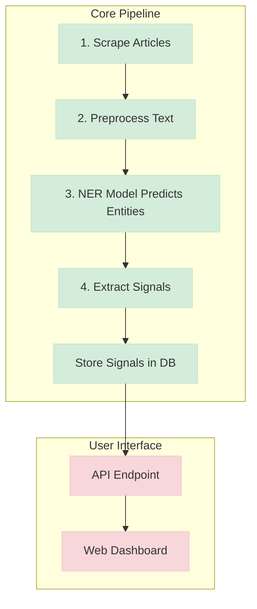

# Private Company Signal Extractor


A sophisticated data pipeline that automatically scrapes news articles, identifies key business events using a custom-trained NER model, and presents the findings in a clean web interface. This project transforms unstructured text into structured, actionable market intelligence.

## Features

- **Targeted Web Scraping**: Scrapes articles specifically from the "Venture" section of news sites like TechCrunch to gather relevant data.
- **Custom NER Model**: Utilizes a fine-tuned BERT model from HuggingFace Transformers to accurately identify custom entities like `COMPANY`, `FINANCIAL`, and `PERSON`.
- **Rule-Based Signal Extraction**: Implements a hybrid NER + regex system to robustly identify `FUNDING` and `ACQUISITION` signals.
- **Interactive Web Interface**: A clean, modern UI built with Flask and Bootstrap that displays extracted signals in a searchable and sortable table.
- **End-to-End Pipeline**: A complete, automated workflow from raw data collection to final presentation.
- **Database Storage**: Uses MongoDB to store raw articles, processed text, and extracted signals for persistence and scalability.

## Architecture

The project follows a standard data processing pipeline, moving from raw data collection to structured analysis and presentation.



## Technology Stack

- **Backend**: Python, Flask
- **Machine Learning**: PyTorch, HuggingFace Transformers, spaCy
- **Database**: MongoDB (via pymongo)
- **Web Scraping**: Requests, BeautifulSoup4
- **Frontend**: HTML, Bootstrap 5, Simple-DataTables
- **Tooling**: Jupyter, Git

## Setup and Installation

Follow these steps to get the project running on your local machine.

**1. Clone the repository:**
```bash
git clone https://github.com/Mikki-H/private-company-signal-extractor.git
cd private-company-signal-extractor
```

**2. Create and activate a virtual environment:**
```bash
# For Windows
python -m venv venv
.\venv\Scripts\activate

# For macOS/Linux
python3 -m venv venv
source venv/bin/activate
```

**3. Install dependencies:**
Make sure you have a local MongoDB server running. Then, install all required packages.
```bash
pip install -r requirements.txt
```

## Usage

The pipeline is designed to be run in sequence.

**1. Scrape the latest articles:**
This script clears the database and fetches new articles from the TechCrunch "Venture" section.
```bash
python src/scraper/techcrunch_scraper.py
```

**2. Preprocess the articles:**
This script cleans the raw HTML, processes the text with spaCy, and stores the results.
```bash
python src/preprocessing/text_processor.py
```

**3. Extract signals from the processed text:**
This script uses the trained NER model to find signals and stores them in the `signals` collection.
```bash
python process_signals.py
```

**4. Launch the Web Interface:**
Start the Flask server to view the results in your browser.
```bash
python -m src.api.app
```
Navigate to `http://127.0.0.1:5000` in your web browser.

---
*Note: To retrain the NER model with new data, you can add examples to `data/processed/ner_training_data.json` and run `python -m src.ml.ner_trainer`.* 