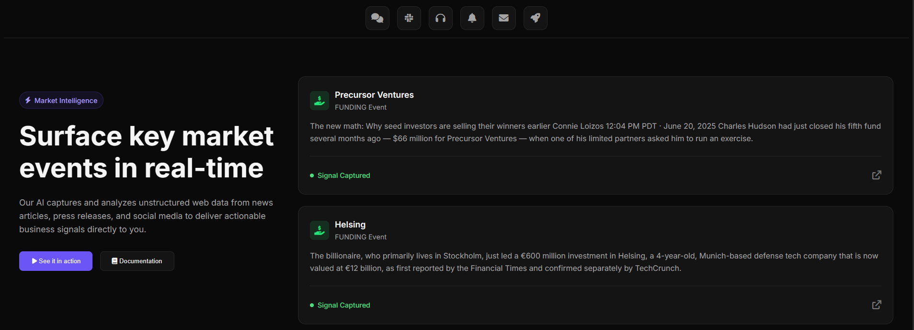

# Market Signal Intelligence


A sophisticated, end-to-end data pipeline that automatically scrapes financial news, identifies key market events (like funding and M&A) using a custom-trained NER model, and presents the findings in a polished, real-time web interface.

This project transforms unstructured web content into structured, actionable market intelligence.



## Features

- **Targeted Web Scraping**: Automatically scrapes articles from high-value sources like the TechCrunch "Venture" section.
- **Custom NER Model**: Utilizes a fine-tuned BERT model from HuggingFace Transformers to accurately identify custom entities like `COMPANY`, `FINANCIAL`, and `PERSON`.
- **Hybrid Signal Extraction**: A robust hybrid system (NER + regex) to pinpoint `FUNDING` and `ACQUISITION` signals with high precision.
- **Modern Web Interface**: A sleek, responsive dashboard built with Flask that displays extracted signals in real-time.
- **End-to-End Pipeline**: A complete, automated workflow from raw data collection to final presentation.
- **Scalable Database**: Uses MongoDB to store raw articles, processed text, and extracted signals for persistence and scalability.

## Architecture

The project follows a modular data pipeline, moving from raw data collection through analysis to final presentation in the web interface.

```mermaid
graph TD;
    subgraph "Data Ingestion & Processing"
        direction LR
        A["1. Scrape Articles"] --> B["2. Preprocess Text & Store"];
    end
    
    subgraph "Signal Extraction"
        direction LR
        B --> C["3. NER Model Predicts Entities"];
        C --> D["4. Extract Signals"];
    end

    subgraph "Presentation Layer"
        direction LR
        D --> E["Store Signals in DB"];
        E --> F["API Endpoint"];
        F --> G["Web Dashboard"];
    end

    style A fill:#141414,stroke:#6C55F5
    style B fill:#141414,stroke:#6C55F5
    style C fill:#141414,stroke:#6C55F5
    style D fill:#141414,stroke:#6C55F5
    style E fill:#141414,stroke:#6C55F5
    style F fill:#141414,stroke:#A89DF8
    style G fill:#141414,stroke:#A89DF8
```



## Technology Stack

- **Backend**: Python, Flask
- **Machine Learning**: PyTorch, HuggingFace Transformers, spaCy
- **Database**: MongoDB (via pymongo)
- **Web Scraping**: Requests, BeautifulSoup4
- **Frontend**: HTML, CSS, JavaScript
- **Tooling**: Git, Virtualenv

## Setup and Installation

Follow these steps to get the project running on your local machine.

**1. Clone the repository:**
```bash
git clone https://github.com/Mikki-H/private-company-signal-extractor.git
cd private-company-signal-extractor
```

**2. Create and activate a virtual environment:**
```bash
# For Windows
python -m venv venv
.\\venv\\Scripts\\activate

# For macOS/Linux
python3 -m venv venv
source venv/bin/activate
```

**3. Install dependencies:**
Make sure you have a local MongoDB server running. Then, install all required packages.
```bash
pip install -r requirements.txt
```

## Usage

The entire pipeline can be run with a single script.

**1. Run the Full Pipeline:**
This master script handles everything: clearing the database, scraping new articles, processing them, and extracting signals.
```bash
python process_signals.py
```

**2. Launch the Web Interface:**
Start the Flask server to view the results in your browser.
```bash
python -m src.api.app
```
Navigate to `http://127.0.0.1:5000` in your web browser.

---
*Note: To retrain the NER model with new data, you can add examples to `data/processed/ner_training_data.json` and run `python -m src.ml.ner_trainer`.* 